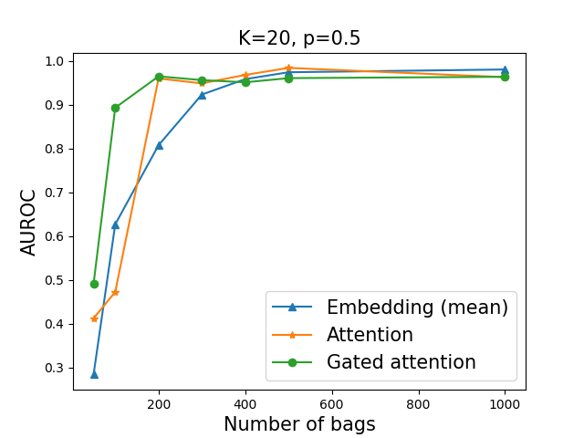
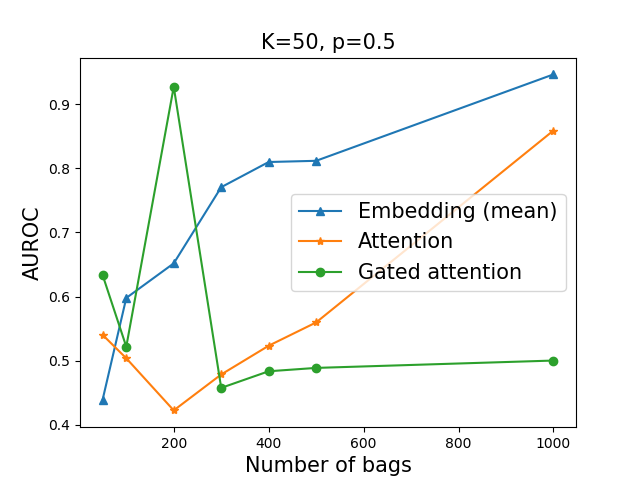

# Multiple instance learning for weakly supervised learning

* (2019-09-17) First upload the code to reproduce results of "Attention-based Deep Multiple Instance Learning", https://arxiv.org/abs/1802.04712
* (2019-09-20) Update the codes and upload results

# Task description
In our experiment, we have $N$ training bags each of which have $K$ instances. Each bag have a single image of digit '9' with the probability $p$.
Our aim is to obtain a model that classifies a given bag as a positive/negative when the bag have/don't have a image of number 9. 

We used multiple-instance learning algorithm, as described in "Attention-based Deep Multiple Instance Learning", https://arxiv.org/abs/1802.04712. 
We compare the mean-pooling, the attention-pooling, and the gated-attention-pooling of embeddings. 
Experimental results are shown as below. The number of training bags is denoted in the x-axis and the number of training bags is 1,000.
We found that, if a percentage of a target image in a bag is too small (in this case 2% for K=50), it is difficult to obtain a correct model. 
Suppose that we want to apply MIL algorithm for medical imaging, where the number of meaningful patch is much smaller than the number of patches per whole slide image. 
In such cases, in order to obtain high accuracy, it may be necessary to use sufficient number of training bags (whole slide images).
To see an example, we refer ones to https://www.nature.com/articles/s41591-019-0508-1.

